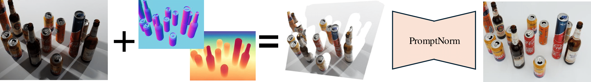

<div align="center">

# PromptNorm: Image Geometry Guides Ambient Light Normalization

By David Serrano-Lozano, Francisco A. Molina-Bakhos, Danna Xue, Yixiong Yang, Maria Pilligua, Ramon Baldrich, Maria Vanrell and Javier Vazquez-Corral
<br>
Computer Vision Center and Universitat Autònoma de Barcelona

[](https://github.com/davidserra9/promptnorm)



</div>

## 📖 Abstract
Ambient lighting normalization is an important computer vision task that aims to remove shadows and standardize illumination across an entire image. While previous approaches have primarily focused on image restoration and frequency-based cues, this paper hypothesizes that incorporating image geometry can significantly improve the normalization process. We propose PromptNorm, a novel transformer-based model that leverages state-of-the-art monocular depth estimators to overcome the challenges posed by strong shadows and extreme color distortions. Our approach uniquely utilizes image normals as a guiding mechanism. We encode these normals to generate a low-level geometric representation, which is then used as Query inputs to weight the attention maps within transformer blocks dynamically.
Comprehensive experimental evaluations demonstrate that PromptNorm not only outperforms existing state-of-the-art methods in ambient lighting normalization but also validates the effectiveness of integrating geometric information into image processing techniques. Both quantitative metrics and qualitative assessments confirm the effectiveness of our method.

## 📊 Dataset
We use the [Ambient6K dataset](https://link.springer.com/chapter/10.1007/978-3-031-72897-6_22). To download all the images please check the [official repository](https://github.com/fvasluianu97/IFBlend). We also use [Depth Anything V2](https://proceedings.neurips.cc/paper_files/paper/2024/hash/26cfdcd8fe6fd75cc53e92963a656c58-Abstract-Conference.html) to generate depth maps and the consequent surface normals. You can download the ambient6k dataset with depth maps and surface normals [here](aaaa). Alternatively, you can check the Depth Anythig V2 [official repository](https://github.com/DepthAnything/Depth-Anything-V2) to generate them and the ```utils/depth_to_normal.py``` to generate the normal maps. Then, the dataset should be structured with the following structure:

```
ambient6k
|-- train
|   |-- input
|   |   |-- 0_input.png
|   |   |-- 1_input.png
|   |   ...
|   |-- normals
|   |   |-- 0_normal.png
|   |   |-- 1_normal.png
|   |   ...
|   |-- target
|   |   |-- 0_gt.png
|   |   |-- 1_gt.png
|   |   ...
|
|-- test
    ...
```

## 🏋️ Training
Modify the configurations of the ```options.py``` file and run the following command:

```
python train.py
```

## 🚀 Inference
Fist, download the pretraind model [here](https://github.com/davidserra9/promptnorm/releases/download/v1.0/promptnorm.ckpt) and place it in the ```pretrained_ckpt``` folder.

Again, modify the configurations of the ```options.py``` file and run the following command:

```
python test.py
```
This script takes all the image in the ambient6k test folder and saves the outputs in ```output_path```.

## ♟️ Results

|             | PSNR ↑  | SSIM ↑ | Images  |
|-------------|---------|--------|---------|
| PromptNorm  | 22.116  | 0.822  | [Download](aaa) |

## Acknowledgements

We acknowledge the FPI grant from Spanish Ministry of Science and Innovation (PRE2022-101525), Departament de Recerca i Universitats with ref. 2021SGR01499 and the CERCA Program from Generalitat de Catalunya, Grant PID2021-128178OB-I00 funded by MCIN/AEI/10.13039/501100011033, ERDF "A way of making Europe", and the grant Càtedra ENIA UAB-Cruïlla (TSI-100929-2023-2) from the Ministry of Economic Affairs and Digital Transformation of Spain.

The following repositories represented valuable resources in our work:

- [https://github.com/va1shn9v/PromptIR](https://github.com/va1shn9v/PromptIR)
- [https://github.com/DepthAnything/Depth-Anything-V2](https://github.com/DepthAnything/Depth-Anything-V2)

## Citation
```
@inproceedings{promptnorm2025,
  title={PromptNorm: Image Geometry Guides Ambient Light Normalization}, 
  author={Serrano-Lozano, David and Molina-Bakhos, Francisco A. and Xue, Danna and Yang, Yixiong and Pilligua, Maria and Baldrich, Ramon and Vanrell, Maria and Vazquez-Corral, Javier},
  booktitle={CVPRW},
  year={2025}
}
```